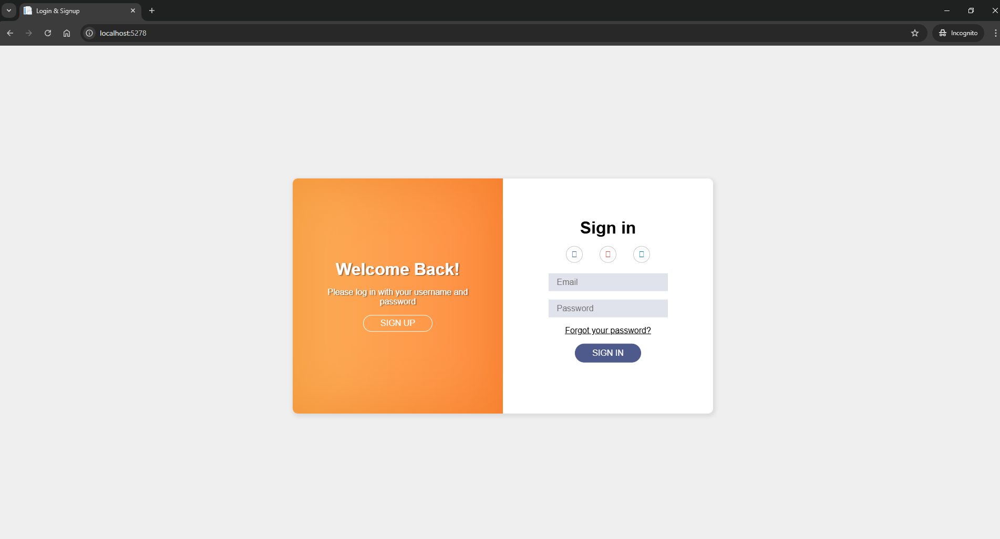
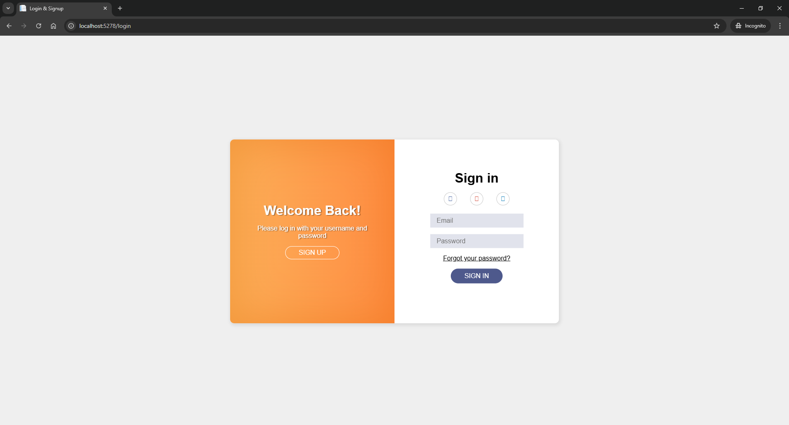
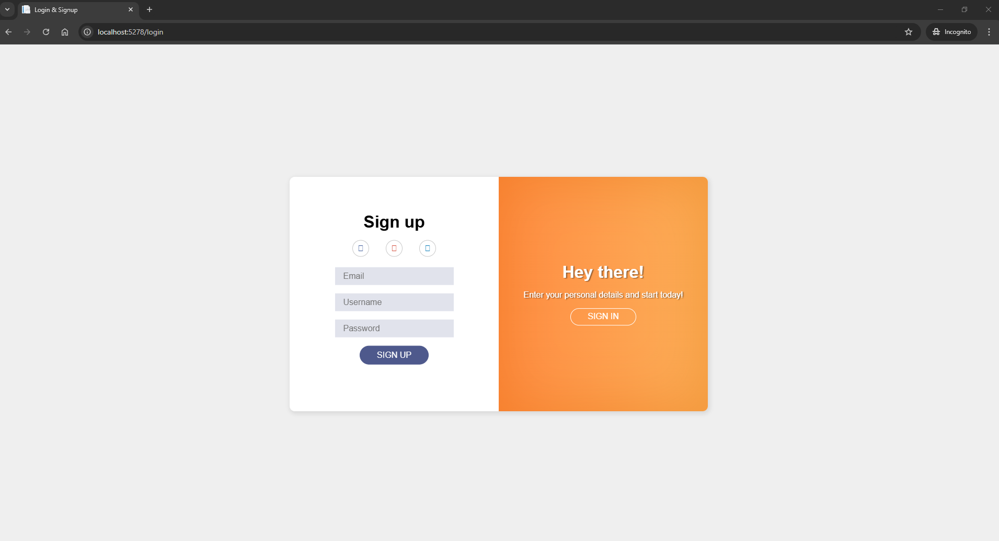

# Migrate from PHP to ASP.NET Project
- ASP.NET Core 8.0

## Build and Run

### ASP.NET Project
```bash
cd src/
```

run project with:
```bash
dotnet run
```

Test:
Access to:
- For login1 page (this page is migrated from login1 page of php project):
http://localhost:5278
 
- For login2 page (there is a little difference with the login1 page above):
http://localhost:5278/login2

Output:

login1 page(asp.net-project):


login2 page (asp.net-project):


signup page(asp.net-project):


signup2 page(asp.net-project):
